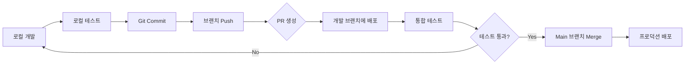

# Supabase Edge Functions 관리 가이드

> Supabase Edge Functions를 효과적으로 개발하고 배포하는 방법

## 개요

Supabase Edge Functions는 Deno 런타임 기반의 서버리스 함수입니다. 이 가이드는 프로젝트에서 Edge Functions를 구조화하고, 개발하고, 배포하는 모범 사례를 제공합니다.

## 목차

- [프로젝트 구조](#프로젝트-구조)
- [개발 워크플로우](#개발-워크플로우)
- [로컬 개발 환경 설정](#로컬-개발-환경-설정)
- [함수 작성 가이드](#함수-작성-가이드)
- [배포 전략](#배포-전략)
- [환경 변수 관리](#환경-변수-관리)
- [CI/CD 설정](#cicd-설정)
- [문제 해결](#문제-해결)

## 프로젝트 구조

### 권장 디렉토리 구조

```
project-root/
├── supabase/
│   ├── functions/                    # Edge Functions 디렉토리
│   │   ├── _shared/                 # 공유 유틸리티 및 타입
│   │   │   ├── cors.ts              # CORS 헤더 설정
│   │   │   ├── supabaseClient.ts    # Supabase 클라이언트 헬퍼
│   │   │   ├── types.ts             # 공유 타입 정의
│   │   │   └── utils.ts             # 공통 유틸리티 함수
│   │   │
│   │   ├── function-name-1/         # 각 함수별 디렉토리
│   │   │   ├── index.ts             # 함수 진입점
│   │   │   ├── handler.ts           # 비즈니스 로직 (선택)
│   │   │   └── types.ts             # 함수별 타입 (선택)
│   │   │
│   │   ├── function-name-2/
│   │   │   └── index.ts
│   │   │
│   │   └── deno.json                # Import map 및 Deno 설정
│   │
│   ├── config.toml                  # Supabase 프로젝트 설정
│   ├── .env.local                   # 로컬 환경 변수 (gitignore)
│   └── .gitignore
│
├── .github/
│   └── workflows/
│       └── deploy-functions.yml     # CI/CD 워크플로우
│
└── docs/
    └── api/
        └── endpoints/
            └── edge-functions.md    # Edge Functions API 문서
```

### 초기 설정

```bash
# Supabase CLI 설치
npm install -g supabase

# 프로젝트 초기화 (supabase/ 디렉토리 생성)
supabase init

# 프로젝트 링크 (최초 1회만)
supabase link --project-ref <your-project-ref>
```

## 개발 워크플로우

### 권장 워크플로우



### 개발 단계

1. **로컬 개발**: Supabase CLI + Deno로 로컬 서버 실행
2. **브랜치 작업**: Feature 브랜치에서 개발
3. **테스트**: 로컬 및 개발 환경에서 테스트
4. **배포**: PR 승인 후 프로덕션 배포

## 로컬 개발 환경 설정

### 1. Deno 설치

```bash
# macOS/Linux
curl -fsSL https://deno.land/install.sh | sh

# Windows (PowerShell)
irm https://deno.land/install.ps1 | iex

# 설치 확인
deno --version
```

### 2. 로컬 Supabase 시작

```bash
# Supabase 로컬 인스턴스 시작 (PostgreSQL, Auth, Storage 등)
supabase start

# Edge Functions 로컬 서버 시작
supabase functions serve

# 특정 함수만 실행
supabase functions serve function-name --env-file supabase/.env.local

# 특정 포트로 실행
supabase functions serve --port 54321
```

### 3. 환경 변수 설정

```bash
# supabase/.env.local 생성
SUPABASE_URL=http://localhost:54321
SUPABASE_ANON_KEY=your-anon-key
SUPABASE_SERVICE_ROLE_KEY=your-service-role-key
CUSTOM_API_KEY=your-custom-api-key
```

## 함수 작성 가이드

### 기본 함수 구조

```typescript
// supabase/functions/example-function/index.ts
import { serve } from "https://deno.land/std@0.168.0/http/server.ts"
import { createClient } from 'https://esm.sh/@supabase/supabase-js@2'
import { corsHeaders } from '../_shared/cors.ts'

serve(async (req) => {
  // CORS preflight 처리
  if (req.method === 'OPTIONS') {
    return new Response('ok', { headers: corsHeaders })
  }

  try {
    // Supabase 클라이언트 생성 (사용자 컨텍스트 포함)
    const supabaseClient = createClient(
      Deno.env.get('SUPABASE_URL') ?? '',
      Deno.env.get('SUPABASE_ANON_KEY') ?? '',
      {
        global: {
          headers: { Authorization: req.headers.get('Authorization')! }
        }
      }
    )

    // 요청 본문 파싱
    const { param1, param2 } = await req.json()

    // 비즈니스 로직
    const { data, error } = await supabaseClient
      .from('table_name')
      .select('*')
      .eq('column', param1)

    if (error) throw error

    // 성공 응답
    return new Response(
      JSON.stringify({ data }),
      {
        headers: { ...corsHeaders, 'Content-Type': 'application/json' },
        status: 200
      }
    )
  } catch (error) {
    // 에러 응답
    return new Response(
      JSON.stringify({ error: error.message }),
      {
        headers: { ...corsHeaders, 'Content-Type': 'application/json' },
        status: 400
      }
    )
  }
})
```

### CORS 헤더 공유 (_shared/cors.ts)

```typescript
// supabase/functions/_shared/cors.ts
export const corsHeaders = {
  'Access-Control-Allow-Origin': '*',
  'Access-Control-Allow-Headers': 'authorization, x-client-info, apikey, content-type',
}
```

### Supabase 클라이언트 헬퍼 (_shared/supabaseClient.ts)

```typescript
// supabase/functions/_shared/supabaseClient.ts
import { createClient } from 'https://esm.sh/@supabase/supabase-js@2'

export function createSupabaseClient(authHeader: string | null) {
  return createClient(
    Deno.env.get('SUPABASE_URL') ?? '',
    Deno.env.get('SUPABASE_ANON_KEY') ?? '',
    {
      global: {
        headers: authHeader ? { Authorization: authHeader } : {}
      }
    }
  )
}

// 서비스 롤 클라이언트 (관리자 권한)
export function createServiceClient() {
  return createClient(
    Deno.env.get('SUPABASE_URL') ?? '',
    Deno.env.get('SUPABASE_SERVICE_ROLE_KEY') ?? ''
  )
}
```

### 타입 정의 공유 (_shared/types.ts)

```typescript
// supabase/functions/_shared/types.ts
export interface ApiResponse<T = unknown> {
  data?: T
  error?: string
}

export interface Shop {
  id: string
  name: string
  location: {
    lat: number
    lng: number
  } | null
  created_at: string
}
```

### Import Map 설정 (deno.json)

```json
{
  "imports": {
    "@supabase/supabase-js": "https://esm.sh/@supabase/supabase-js@2.39.0",
    "std/": "https://deno.land/std@0.168.0/"
  },
  "tasks": {
    "test": "deno test --allow-all",
    "dev": "deno run --allow-all --watch index.ts"
  }
}
```

## 배포 전략

### Option 1: Supabase CLI (권장)

#### 단일 함수 배포

```bash
# 특정 함수 배포
supabase functions deploy function-name

# 검증 없이 배포 (프로덕션에서는 비권장)
supabase functions deploy function-name --no-verify-jwt
```

#### 전체 함수 배포

```bash
# 모든 함수 배포
supabase functions deploy

# 특정 프로젝트에 배포
supabase functions deploy --project-ref <project-ref>
```

#### 배포 후 확인

```bash
# 배포된 함수 목록 확인
supabase functions list

# 함수 로그 확인
supabase functions logs function-name

# 실시간 로그 스트림
supabase functions logs function-name --follow
```

### Option 2: MCP Supabase Server

현재 프로젝트에는 MCP Supabase 서버가 설정되어 있어, Claude를 통해 직접 관리할 수 있습니다:

```javascript
// Claude에게 요청 예시:
"현재 Edge Functions 목록 보여줘"
"create-shop 함수 코드 확인해줘"
"새로운 Edge Function 'get-shop-stats' 배포해줘"
```

**장점:**
- 대화형 인터페이스로 빠른 배포
- 자동화된 배포 프로세스
- 코드 생성 및 수정 지원

**단점:**
- 로컬 테스트 제한적
- Git 히스토리 추적 어려움

### Option 3: Supabase Branching (개발/프로덕션 분리)

```bash
# 개발 브랜치 생성
supabase branches create develop

# 개발 브랜치에 배포
supabase functions deploy --branch develop

# 테스트 후 메인 브랜치에 병합
supabase branches merge develop
```

## 환경 변수 관리

### 로컬 환경 변수

```bash
# supabase/.env.local (로컬 개발용)
SUPABASE_URL=http://localhost:54321
SUPABASE_ANON_KEY=eyJ...
STRIPE_API_KEY=sk_test_...
CUSTOM_API_URL=http://localhost:3000
```

### 프로덕션 환경 변수 (Secrets)

```bash
# Secret 설정
supabase secrets set STRIPE_API_KEY=sk_live_xxx

# 여러 Secret 한 번에 설정
supabase secrets set --env-file .env.production

# Secret 목록 확인
supabase secrets list

# Secret 삭제
supabase secrets unset STRIPE_API_KEY
```

### 프로젝트별 환경 변수

```bash
# 특정 프로젝트에 설정
supabase secrets set STRIPE_API_KEY=sk_live_xxx --project-ref <project-ref>
```

## CI/CD 설정

### GitHub Actions 워크플로우

```yaml
# .github/workflows/deploy-functions.yml
name: Deploy Edge Functions

on:
  push:
    branches:
      - main
    paths:
      - 'supabase/functions/**'
  pull_request:
    branches:
      - main
    paths:
      - 'supabase/functions/**'

jobs:
  deploy:
    runs-on: ubuntu-latest

    steps:
      - name: Checkout code
        uses: actions/checkout@v4

      - name: Setup Supabase CLI
        uses: supabase/setup-cli@v1
        with:
          version: latest

      - name: Deploy to Development (on PR)
        if: github.event_name == 'pull_request'
        run: |
          supabase functions deploy --project-ref ${{ secrets.SUPABASE_DEV_PROJECT_REF }}
        env:
          SUPABASE_ACCESS_TOKEN: ${{ secrets.SUPABASE_ACCESS_TOKEN }}

      - name: Deploy to Production (on merge)
        if: github.event_name == 'push' && github.ref == 'refs/heads/main'
        run: |
          supabase functions deploy --project-ref ${{ secrets.SUPABASE_PROD_PROJECT_REF }}
        env:
          SUPABASE_ACCESS_TOKEN: ${{ secrets.SUPABASE_ACCESS_TOKEN }}

      - name: Notify deployment status
        if: always()
        run: |
          echo "Deployment completed with status: ${{ job.status }}"
```

### Required GitHub Secrets

Repository Settings > Secrets and variables > Actions에 다음 시크릿 추가:

- `SUPABASE_ACCESS_TOKEN`: Supabase 액세스 토큰 (Dashboard > Account > Access Tokens)
- `SUPABASE_DEV_PROJECT_REF`: 개발 환경 프로젝트 ID
- `SUPABASE_PROD_PROJECT_REF`: 프로덕션 환경 프로젝트 ID

## 테스트

### 로컬 테스트

```bash
# cURL을 사용한 테스트
curl -i --location --request POST \
  'http://localhost:54321/functions/v1/function-name' \
  --header 'Authorization: Bearer YOUR_ANON_KEY' \
  --header 'Content-Type: application/json' \
  --data '{"param1": "value1"}'

# 또는 Supabase 클라이언트로 테스트
const { data, error } = await supabase.functions.invoke('function-name', {
  body: { param1: 'value1' }
})
```

### 유닛 테스트 (Deno Test)

```typescript
// supabase/functions/example-function/index.test.ts
import { assertEquals } from "https://deno.land/std@0.168.0/testing/asserts.ts"

Deno.test("Function processes request correctly", async () => {
  const request = new Request("http://localhost:8000", {
    method: "POST",
    body: JSON.stringify({ param1: "test" })
  })

  // Test logic here
  assertEquals(true, true)
})
```

```bash
# 테스트 실행
deno test --allow-all supabase/functions/example-function/
```

## 모니터링 및 디버깅

### 로그 확인

```bash
# 최근 로그 확인
supabase functions logs function-name

# 실시간 로그 스트림
supabase functions logs function-name --follow

# 에러만 필터링
supabase functions logs function-name --level error
```

### 프로젝트 대시보드

Supabase Dashboard > Edge Functions에서:
- 함수 실행 통계
- 에러율
- 응답 시간
- 호출 횟수

## 문제 해결

### 일반적인 문제

#### 1. CORS 에러

**문제**: 프론트엔드에서 함수 호출 시 CORS 에러 발생

**해결**:
```typescript
// OPTIONS 메서드 처리 확인
if (req.method === 'OPTIONS') {
  return new Response('ok', { headers: corsHeaders })
}

// 모든 응답에 CORS 헤더 포함
return new Response(JSON.stringify(data), {
  headers: { ...corsHeaders, 'Content-Type': 'application/json' }
})
```

#### 2. 환경 변수 접근 불가

**문제**: `Deno.env.get()` 결과가 undefined

**해결**:
```bash
# 로컬: .env.local 파일 확인
supabase functions serve --env-file supabase/.env.local

# 프로덕션: Secrets 설정 확인
supabase secrets list
```

#### 3. Import 에러

**문제**: 모듈을 찾을 수 없음

**해결**:
```json
// deno.json에 import map 추가
{
  "imports": {
    "@supabase/supabase-js": "https://esm.sh/@supabase/supabase-js@2.39.0"
  }
}
```

#### 4. 인증 에러

**문제**: RLS 정책으로 인한 권한 거부

**해결**:
```typescript
// 사용자 인증 토큰 전달
const supabaseClient = createClient(
  Deno.env.get('SUPABASE_URL') ?? '',
  Deno.env.get('SUPABASE_ANON_KEY') ?? '',
  {
    global: {
      headers: { Authorization: req.headers.get('Authorization')! }
    }
  }
)

// 또는 서비스 롤 사용 (RLS 우회)
const supabaseClient = createClient(
  Deno.env.get('SUPABASE_URL') ?? '',
  Deno.env.get('SUPABASE_SERVICE_ROLE_KEY') ?? ''
)
```

### 디버깅 팁

```typescript
// 콘솔 로그는 Supabase 대시보드에서 확인 가능
console.log('Request received:', { method: req.method, url: req.url })
console.error('Error occurred:', error)

// 상세한 에러 정보 포함
try {
  // ...
} catch (error) {
  console.error('Detailed error:', {
    message: error.message,
    stack: error.stack,
    timestamp: new Date().toISOString()
  })
  throw error
}
```

## 보안 모범 사례

### 1. 환경 변수로 민감 정보 관리

```typescript
// ❌ 하드코딩하지 않기
const apiKey = 'sk_live_123456789'

// ✅ 환경 변수 사용
const apiKey = Deno.env.get('STRIPE_API_KEY')
```

### 2. 입력 검증

```typescript
// 입력 데이터 검증
const { name, email } = await req.json()

if (!name || typeof name !== 'string') {
  return new Response(
    JSON.stringify({ error: 'Invalid name parameter' }),
    { status: 400, headers: corsHeaders }
  )
}

if (!email || !email.includes('@')) {
  return new Response(
    JSON.stringify({ error: 'Invalid email parameter' }),
    { status: 400, headers: corsHeaders }
  )
}
```

### 3. Rate Limiting

```typescript
// Supabase Dashboard에서 설정 가능
// 또는 코드 레벨에서 구현
import { RateLimiter } from '../_shared/rateLimiter.ts'

const limiter = new RateLimiter({ maxRequests: 100, windowMs: 60000 })
if (!limiter.checkLimit(userId)) {
  return new Response(
    JSON.stringify({ error: 'Rate limit exceeded' }),
    { status: 429, headers: corsHeaders }
  )
}
```

### 4. 인증 확인

```typescript
// JWT 토큰 검증
const authHeader = req.headers.get('Authorization')
if (!authHeader) {
  return new Response(
    JSON.stringify({ error: 'Missing authorization header' }),
    { status: 401, headers: corsHeaders }
  )
}

// Supabase Auth를 통한 사용자 확인
const { data: { user }, error } = await supabaseClient.auth.getUser()
if (error || !user) {
  return new Response(
    JSON.stringify({ error: 'Unauthorized' }),
    { status: 401, headers: corsHeaders }
  )
}
```

## 성능 최적화

### 1. 콜드 스타트 최소화

```typescript
// 전역 변수로 재사용 가능한 리소스 캐싱
let cachedClient: SupabaseClient | null = null

serve(async (req) => {
  if (!cachedClient) {
    cachedClient = createClient(...)
  }
  // cachedClient 사용
})
```

### 2. 병렬 처리

```typescript
// 독립적인 작업은 병렬로 실행
const [userData, shopData, productData] = await Promise.all([
  supabaseClient.from('users').select('*').eq('id', userId).single(),
  supabaseClient.from('shops').select('*').eq('owner_id', userId),
  supabaseClient.from('products').select('*').limit(10)
])
```

### 3. 응답 스트리밍 (대용량 데이터)

```typescript
// ReadableStream 사용
const stream = new ReadableStream({
  async start(controller) {
    // 데이터를 청크로 전송
    controller.enqueue(new TextEncoder().encode('chunk1'))
    controller.enqueue(new TextEncoder().encode('chunk2'))
    controller.close()
  }
})

return new Response(stream, {
  headers: { ...corsHeaders, 'Content-Type': 'text/plain' }
})
```

## 관련 문서

- [Supabase 공식 문서 - Edge Functions](https://supabase.com/docs/guides/functions)
- [Deno 공식 문서](https://deno.land/manual)
- [프로젝트 Setup 가이드](../setup/MCP_SETUP.md)
- [API 엔드포인트 문서](../api/overview.md)
- [환경 변수 설정](../setup/environment.md)

## 체크리스트

### 초기 설정
- [ ] Supabase CLI 설치
- [ ] `supabase init` 실행
- [ ] 프로젝트 링크 (`supabase link`)
- [ ] `supabase/functions/_shared/` 디렉토리 생성
- [ ] CORS 헤더 공유 파일 작성
- [ ] Import map 설정 (deno.json)

### 함수 개발
- [ ] 함수별 디렉토리 생성
- [ ] CORS 처리 구현
- [ ] 입력 검증 추가
- [ ] 에러 핸들링 구현
- [ ] 타입 정의 작성
- [ ] 로컬 테스트 실행

### 배포 전
- [ ] 환경 변수 확인
- [ ] 로컬에서 충분히 테스트
- [ ] 보안 검토 (민감 정보 하드코딩 확인)
- [ ] 로그 메시지 확인
- [ ] 문서 업데이트

### 배포 후
- [ ] 프로덕션에서 테스트
- [ ] 로그 모니터링
- [ ] 성능 메트릭 확인
- [ ] 에러율 모니터링

## 업데이트 이력

- 2025-01-30: 초안 작성
