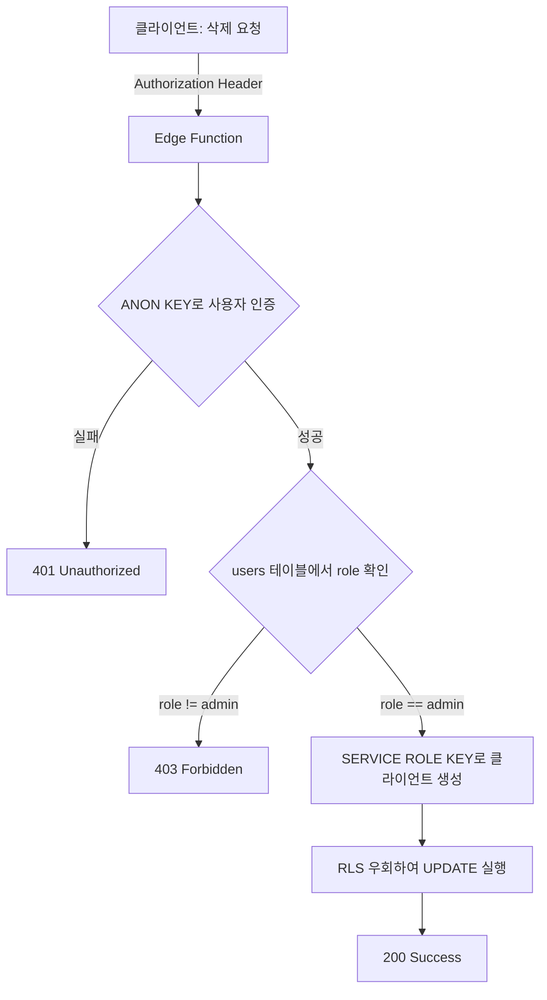

# RLS 정책 위반: Shops 테이블 UPDATE 권한 거부

## 이슈 개요

**발생일**: 2025-10-31
**영향 범위**: 스토어 삭제 기능
**심각도**: High (핵심 기능 동작 불가)

## 문제 설명

관리자가 스토어 삭제 버튼을 클릭했을 때, 다음과 같은 RLS(Row Level Security) 정책 위반 에러가 발생했습니다.

### 에러 메시지

```
POST https://kabndipxpxxhwqljhsdv.supabase.co/rest/v1/shops?id=eq.40d43998-f3b5-40cf-b880-559d17005a6c

{
    "code": "42501",
    "details": null,
    "hint": null,
    "message": "new row violates row-level security policy for table \"shops\""
}
```

### 에러 발생 위치

**파일**: `src/services/store.api.ts`

```typescript
// ❌ 문제가 있던 코드
export async function deleteStore(id: string): Promise<void> {
  const { error } = await supabase
    .from('shops')
    .update({ is_deleted: true })
    .eq('id', id);

  if (error) {
    throw new Error(error.message || 'Failed to delete store');
  }
}
```

## 원인 분석

### 1. RLS 정책 적용

Supabase의 `shops` 테이블에는 RLS가 활성화되어 있으며, 다음과 같은 정책이 적용되어 있습니다:

```sql
-- Admins have full access
CREATE POLICY "Admins have full access"
ON shops
FOR ALL
TO authenticated
USING (
  auth.jwt() ->> 'role' = 'admin'
);
```

### 2. 클라이언트 측 Supabase 사용의 한계

프론트엔드에서 `supabase` 클라이언트를 사용할 때:

- **사용 키**: `SUPABASE_ANON_KEY` (공개 키)
- **권한**: 일반 사용자 권한
- **RLS 적용**: ✅ 모든 RLS 정책이 적용됨
- **JWT 토큰**: 사용자의 JWT에 `role` 클레임이 포함되어야 함

### 3. JWT 토큰의 role 클레임 문제

현재 인증 시스템에서 JWT 토큰에 `role` 클레임이 제대로 설정되지 않았거나, RLS 정책이 JWT의 role을 올바르게 읽지 못하는 상황이었습니다.

### 4. 아키텍처 설계 문제

관리자 작업(CREATE, UPDATE, DELETE)을 프론트엔드에서 직접 Supabase 클라이언트로 수행하려는 설계 자체가 보안상 취약점이 될 수 있습니다.

## 해결 방법

### Edge Function을 통한 서버 사이드 처리

관리자 권한이 필요한 작업은 **Edge Function**을 통해 서버 사이드에서 처리하도록 변경했습니다.

#### 1단계: Edge Function 생성 (admin-delete-shop)

**파일**: Supabase Edge Function `admin-delete-shop/index.ts`

```typescript
import "jsr:@supabase/functions-js/edge-runtime.d.ts";
import { createClient } from "jsr:@supabase/supabase-js@2";

const corsHeaders = {
  'Access-Control-Allow-Origin': '*',
  'Access-Control-Allow-Headers': 'authorization, x-client-info, apikey, content-type'
};

Deno.serve(async (req) => {
  if (req.method === 'OPTIONS') {
    return new Response('ok', { headers: corsHeaders });
  }

  try {
    const supabaseUrl = Deno.env.get('SUPABASE_URL')!;
    const supabaseAnonKey = Deno.env.get('SUPABASE_ANON_KEY')!;
    const supabaseServiceKey = Deno.env.get('SUPABASE_SERVICE_ROLE_KEY')!;
    const authHeader = req.headers.get('Authorization')!;

    // 1️⃣ ANON KEY로 사용자 인증 확인
    const supabaseClient = createClient(supabaseUrl, supabaseAnonKey, {
      global: { headers: { Authorization: authHeader } }
    });

    const { data: { user }, error: authError } = await supabaseClient.auth.getUser();
    if (authError || !user) {
      return new Response(
        JSON.stringify({ error: 'Unauthorized' }),
        { status: 401, headers: { ...corsHeaders, 'Content-Type': 'application/json' } }
      );
    }

    // 2️⃣ users 테이블에서 admin 권한 확인
    const { data: userData, error: userError } = await supabaseClient
      .from('users')
      .select('role')
      .eq('id', user.id)
      .single();

    if (userError || userData?.role !== 'admin') {
      return new Response(
        JSON.stringify({ error: 'Forbidden: Admin access required' }),
        { status: 403, headers: { ...corsHeaders, 'Content-Type': 'application/json' } }
      );
    }

    // 3️⃣ 요청 본문에서 삭제할 스토어 ID 추출
    const body = await req.json();
    const shopId = body.id;

    if (!shopId) {
      return new Response(
        JSON.stringify({ error: 'Missing required field: id' }),
        { status: 400, headers: { ...corsHeaders, 'Content-Type': 'application/json' } }
      );
    }

    // 4️⃣ SERVICE ROLE KEY로 RLS 우회하여 삭제 수행
    const supabaseAdmin = createClient(supabaseUrl, supabaseServiceKey);

    const { error: deleteError } = await supabaseAdmin
      .from('shops')
      .update({
        is_deleted: true,
        updated_by: user.id
      })
      .eq('id', shopId);

    if (deleteError) {
      console.error('Delete error:', deleteError);
      return new Response(
        JSON.stringify({ error: deleteError.message }),
        { status: 500, headers: { ...corsHeaders, 'Content-Type': 'application/json' } }
      );
    }

    return new Response(
      JSON.stringify({ message: 'Shop deleted successfully' }),
      { status: 200, headers: { ...corsHeaders, 'Content-Type': 'application/json' } }
    );
  } catch (error) {
    console.error('Error:', error);
    return new Response(
      JSON.stringify({ error: error.message }),
      { status: 500, headers: { ...corsHeaders, 'Content-Type': 'application/json' } }
    );
  }
});
```

#### 2단계: 프론트엔드 API 수정

**파일**: `src/services/store.api.ts`

```typescript
/**
 * Delete a store (soft delete)
 */
export async function deleteStore(id: string): Promise<void> {
  // ✅ Edge Function 호출로 변경
  const { error } = await supabase.functions.invoke('admin-delete-shop', {
    body: { id },
  });

  if (error) {
    throw new Error(error.message || 'Failed to delete store');
  }
}
```

## 핵심 개념: ANON_KEY vs SERVICE_ROLE_KEY

| 구분 | ANON_KEY | SERVICE_ROLE_KEY |
|------|----------|------------------|
| **용도** | 클라이언트 사이드 (브라우저) | 서버 사이드 전용 |
| **RLS 적용** | ✅ 모든 RLS 정책 적용 | ❌ RLS 완전 우회 |
| **권한** | 사용자별 권한 제한 | 전체 데이터 접근 가능 |
| **노출** | 공개 가능 (프론트엔드 코드에 포함) | **절대 노출 금지** |
| **사용 위치** | 브라우저, 모바일 앱 | Edge Functions, 백엔드 서버 |

## Edge Function의 보안 처리 흐름



## 배운 교훈

### 1. 관리자 작업은 Edge Function으로

관리자 권한이 필요한 모든 작업(CREATE, UPDATE, DELETE)은:
- ❌ 프론트엔드에서 직접 Supabase 클라이언트 사용 지양
- ✅ Edge Function을 통해 서버 사이드에서 처리

### 2. 2단계 보안 검증

1. **1단계**: ANON_KEY로 사용자 인증 확인
2. **2단계**: 데이터베이스에서 사용자 권한(role) 확인
3. **실행**: SERVICE_ROLE_KEY로 작업 수행

### 3. 보안 원칙

- **최소 권한 원칙**: 클라이언트는 최소한의 권한만 부여
- **서버 사이드 검증**: 모든 권한 검증은 서버에서 수행
- **키 분리**: ANON_KEY(인증) → SERVICE_ROLE_KEY(실행)

## 관련 Edge Functions

현재 프로젝트의 관리자 작업용 Edge Functions:

1. ✅ `admin-create-shop` - 스토어 생성
2. ✅ `admin-delete-shop` - 스토어 삭제 (이번에 생성)
3. ✅ `admin-list-shops` - 스토어 목록 조회
4. ✅ `admin-get-shop` - 스토어 상세 조회

## 참고 문서

- [Supabase RLS 공식 문서](https://supabase.com/docs/guides/auth/row-level-security)
- [Supabase Edge Functions 가이드](https://supabase.com/docs/guides/functions)
- [프로젝트 내 shops 테이블 스키마](../database/tables/shops.md)
- [관련 이슈: RLS INSERT 거부](./rls-shops-insert-denied.md)

## 추가 개선 사항

### 1. 에러 처리 개선

```typescript
// 프론트엔드에서 더 나은 에러 메시지 표시
try {
  await deleteStore.mutateAsync(storeToDelete.id);
  toast.success('스토어가 성공적으로 삭제되었습니다.');
} catch (error) {
  if (error.message.includes('Forbidden')) {
    toast.error('관리자 권한이 없습니다.');
  } else if (error.message.includes('Unauthorized')) {
    toast.error('인증이 만료되었습니다. 다시 로그인해주세요.');
  } else {
    toast.error('스토어 삭제 실패: ' + error.message);
  }
}
```

### 2. 낙관적 업데이트 (Optimistic Update)

```typescript
export function useDeleteStore() {
  const queryClient = useQueryClient();

  return useMutation({
    mutationFn: deleteStore,
    onMutate: async (storeId) => {
      // 이전 데이터 스냅샷 저장
      await queryClient.cancelQueries({ queryKey: ['stores'] });
      const previousStores = queryClient.getQueryData(['stores']);

      // 낙관적으로 UI 업데이트
      queryClient.setQueryData(['stores'], (old) => {
        // 삭제된 스토어 제외
        return {
          ...old,
          data: old.data.filter(store => store.id !== storeId)
        };
      });

      return { previousStores };
    },
    onError: (err, storeId, context) => {
      // 에러 발생 시 이전 상태로 롤백
      queryClient.setQueryData(['stores'], context.previousStores);
    },
    onSuccess: () => {
      // 성공 시 서버 데이터로 동기화
      queryClient.invalidateQueries({ queryKey: ['stores'] });
    },
  });
}
```

## 결론

RLS 정책 위반 에러는 Supabase의 보안 메커니즘이 정상적으로 작동한 결과입니다. 클라이언트 측에서 관리자 작업을 직접 수행하려는 설계를 Edge Function 기반 서버 사이드 처리로 변경하여 보안성과 안정성을 모두 확보했습니다.

**핵심**: 관리자 권한이 필요한 모든 작업은 Edge Function을 통해 처리하고, SERVICE_ROLE_KEY는 절대 클라이언트에 노출하지 않습니다.
